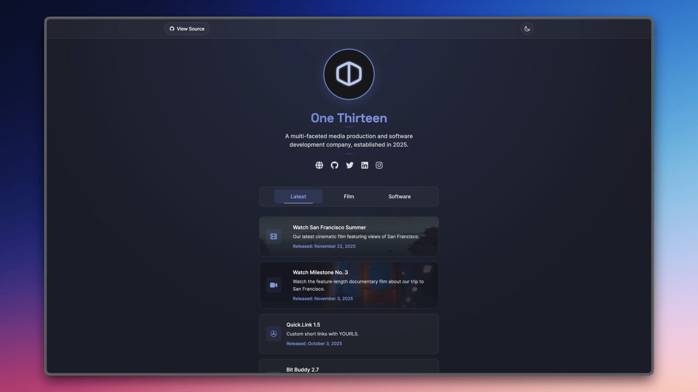

# Link-in-Bio Site by One Thirteen

A modern, responsive, and customizable link-in-bio page built with HTML, CSS, and JavaScript. This project serves as a central hub for One Thirteen's online presence, featuring links to various platforms, apps, and social media.



## Features

- 🎨 **Dark/Light Mode** - Automatic theme switching based on system preferences with manual override
- 📱 **Fully Responsive** - Optimized for all screen sizes from mobile to desktop
- 🚀 **Fast Loading** - Minimal dependencies and optimized assets
- 🎭 **Modern Design** - Clean, minimalist interface with smooth animations
- 🔗 **Customizable Links** - Easy to add, remove, or modify links
- 🌐 **Social Integration** - Direct links to social media platforms
- 📱 **App Showcase** - Dedicated section for showcasing apps and projects

## Tech Stack

- HTML5
- CSS3 (with CSS Variables for theming)
- Vanilla JavaScript
- Font Awesome for icons
- Google Fonts (Inter and Space Grotesk)

## Getting Started

### Prerequisites

- A modern web browser
- Basic knowledge of HTML, CSS, and JavaScript (for customization)

### Installation

1. Clone the repository:
```bash
git clone https://github.com/onethirteenco/link-in-bio.git
```

2. Navigate to the project directory:
```bash
cd link-in-bio
```

3. Open `link-in-bio.html` in your browser or serve it using a local server.

### Customization

1. **Profile Information**
   - Update the profile image in the `img` folder
   - Modify the name and bio in the HTML file

2. **Links**
   - Add or remove links in the `.links` section
   - Update social media links in the `.social-links` section

3. **Apps Section**
   - Add or modify app cards in the `.apps-section`
   - Update app information and download links

4. **Theme Colors**
   - Modify the CSS variables in the `:root` selector to change the color scheme
   - Update the theme colors in the `[data-theme="light"]` selector for light mode

## Browser Support

- Chrome (latest)
- Firefox (latest)
- Safari (latest)
- Edge (latest)
- Mobile browsers (iOS Safari, Android Chrome)

## Contributing

Contributions are welcome! Please feel free to submit a Pull Request.

1. Fork the repository
2. Create your feature branch (`git checkout -b feature/AmazingFeature`)
3. Commit your changes (`git commit -m 'Add some AmazingFeature'`)
4. Push to the branch (`git push origin feature/AmazingFeature`)
5. Open a Pull Request

## License

This project is licensed under the MIT License - see the [LICENSE](LICENSE) file for details.

## Acknowledgments

- Font Awesome for the icons
- Google Fonts for the typography
- All contributors and supporters

## Contact

One Thirteen - [@onethirteen_co](https://x.com/onethirteen_co)

Project Link: [https://github.com/onethirteenco/link-in-bio](https://github.com/onethirteenco/link-in-bio) 